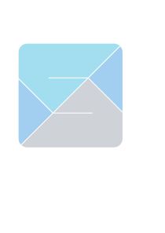

# Skiylia

<div style="display:flex;">
  
  <div style="vertical-align: middle;">
    <p>Dynamically typed.</p>
    <p>Interpreted.</p>
    <p>Object Oriented.</p>
  </div>
</div>

[View on GitHub](https://github.com/Skiylia-Lang/){: .btn .fs-5 .mb-4 .mb-md-0 }

## Example code

```
/// This contains a snippet of Skiylia-code that
    computes the factorial of a number. ///

def factorial(n):
  // return null if n is not an integer.
  if n !~~ 0:
    return null

  // return 1 if n is less than, or equal to, 2.
  if n <= 1:
    return 1

  // otherwise, recursively multiply.
  return n * factorial(n - 1)

var num = 6

print("The factorial of", num, "is", factorial(num))

/// Expected output:
    The factorial of 6 is 720 ///

```
